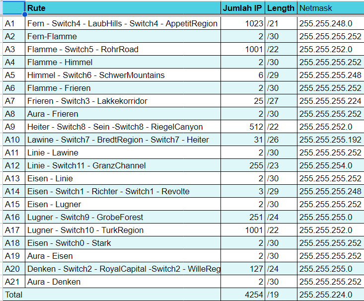

# Jarkom-Modul-4-E26
| Nama | NRP |
|----------|----------|
| Handitanto Herprasetyo | 5025201077 |
| Nadiah Nuri Aisyah  | 5025211210 |  

<h2>Prefix IP</h2>

192.219.X.X

<h2>Soal</h2>

`Langkah 1`

<h3>Menentukan jumlah IP yang dibutuhkan & Plotting Subnet</h3>

- Menentuka jumlah IP

- Plotting Subnet

`Langkah 2`

<h3>Tree Pembagian IP Address & Penentuan NID, Broadcast ID</h3>

- Tree

- NID & Broadcast ID

`Langkah 3`

- Topologi CPT

  
- Konfigurasi CPT

-Testing
